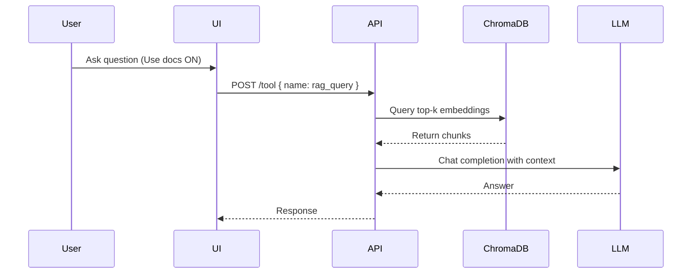

# 💻 Local GPT

Local-first AI assistant with full document RAG, offline LLM chat, system monitoring, and Dockerized deployment.

---

## ✅ What’s Working

| Feature | Status | Notes |
|---------|--------|--------|
| ✅ Local Chat (vLLM / Ollama) | Fully working | Supports openai-compatible models via vLLM & Ollama models locally |
| ✅ Docs Upload + RAG | Fully working | PDF/DOCX/TXT uploaded, chunked, stored in ChromaDB, and queried in chat |
| ✅ Toolserver API | Fully working | `/rag/upload`, `/rag/list`, `/tool (rag_query)`, etc. |
| ✅ Resource Monitoring | Fully working | GPU/CPU/RAM shown in UI using psutil + NVML |
| ✅ Dockerized Setup | Fully working | One command brings up entire stack |
| ⚙️ PDF Text Extraction | Working | Uses `pdfplumber` & `PyMuPDF` |
| ⚙️ Embeddings | Working | ONNX MiniLM L6-V2 or SentenceTransformer fallback |
| ⚙️ ChromaDB Vector Store | Working | Persistent at `/data/chroma_v2` |
| 🛠 RAG in Chat | Working | Injects context as system messages when enabled |

---

## 📂 Updated Project Structure
```
local-gpt/
├── docker-compose.yml
├── Dockerfile
├── README.md
│
├── backend/ # FastAPI Toolserver
│ ├── app.py # FastAPI entry
│ ├── tool_router.py # /tool → rag_query, rag_recent, etc.
│ ├── rag_routes.py # /rag/upload, /rag/list
│ ├── vectorstore.py # ChromaDB logic (add/query)
│ ├── file_extract.py # PDF/DOCX parsing
│ ├── tools/
│ │ ├── init.py
│ │ ├── rag.py # rag_upsert implementation
│ │ ├── system.py # System tool example
│ └── requirements.txt
│
├── web/ (or frontend/) # Next.js UI
│ ├── next.config.js
│ ├── package.json
│ ├── pages/
│ │ ├── index.tsx # Main chat UI + RAG sidebar
│ │ ├── api/chat.ts # Handles RAG + chat -> vLLM/Ollama
│ ├── components/
│ │ ├── ChatWindow.tsx
│ │ ├── DocsRagPanel.tsx # Upload + index docs UI
│ │ ├── ResourcePanel.tsx # CPU/GPU monitor
│ └── lib/
│ ├── llm.ts # callOpenAI / callOllama client
│ ├── toolserver.ts # helper for hitting /tool
│
└── data/ (Docker volume)
├── files/ # Uploaded docs
└── chroma_v2/ # Vector DB
```


---

## 🚀 Run with Docker

```bash
docker compose up --build
```
Frontend → http://localhost:3000

Toolserver → http://localhost:8000

Uploaded files → saved in Docker volume /data/files

---

| Step | What Happens |
|------|---------------|
| 1️⃣ Upload | PDF / DOCX / TXT in sidebar |
| 2️⃣ Process | Toolserver extracts → chunks → embeds → stores in ChromaDB |
| 3️⃣ Enable RAG | Toggle **Use docs (RAG)** in the chat UI |
| 4️⃣ Query | API calls `POST /tool (rag_query)` and retrieves top-k chunks |
| 5️⃣ LLM Answer | Chunks are injected as context → local LLM answers using your content |


---
🧠 Example RAG Prompt
After uploading Software_Engineer.pdf:

```pgsql

Using Software_Engineer.pdf in collection default,
summarize the Summary section and suggest improvements.
```
Or a tool-style prompt:
```
"Use the docs I uploaded to answer:
What programming languages are mentioned in my resume?"
```
---



---

### 🚀 Stretch Goals (Future Magic ✨)

| Idea | Why it’s awesome |
|------|--------------------|
| 🌐 **Remote / Web Access** | Host LocalGPT on a server or LAN and access it from any browser or device. |
| 🤖 **Local Function Calling Tools** | Let the AI run local tools: search files, extract chunks, open PDFs, run shell commands (secure sandbox). |
| 📊 **RAG Analytics Dashboard** | Track embeddings DB size, query latency, chunk retrieval accuracy, GPU/CPU performance. |
| 🗂 **Multiple RAG Collections / Workspaces** | Separate documents by project, user, or team — isolate knowledge bases for cleaner context. |
| 📝 **In-App Document Viewer** | Preview stored chunks, pages, metadata, and delete or re-index individual files easily. |
| 🧠 **Hybrid Search (Semantic + Keyword)** | Boost precision by combining vector similarity + keyword filtering for better document answers. |
| 📡 **API Endpoints for External Apps** | Expose `/chat`, `/rag/query`, `/upload` so other apps or scripts can use LocalGPT as an API. |
| 🎯 **Relevance Scoring & Feedback Loop** | Let users upvote/downvote answers and use that to improve ranking over time. |


---

📄 License
MIT — free to modify, share, and build on.

Made with ☕ + 🤖 by Christopher Ramessar
Because boredom needed a hobby.